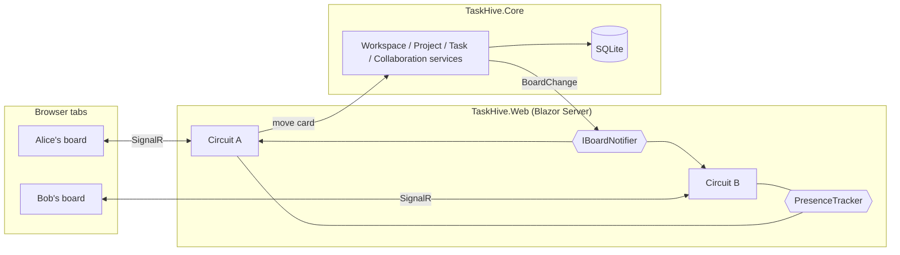

# TaskHive

[](https://github.com/ebrahimmorkas/taskhive-blazor/actions/workflows/ci.yml)


A **real-time, multi-tenant project management SaaS** built with **Blazor (.NET 10)**. Teams get isolated workspaces with Kanban boards; when a teammate moves a card, everyone on the board sees it instantly, together with who else is viewing.

## Features

- **Workspaces as tenants**: owner/admin/member roles; invite teammates by email; strict tenant isolation
- **Kanban boards**: projects with task keys (`WEB-42`), drag and drop between columns, priorities, assignees, due dates, filtering
- **Real-time collaboration**: live board updates with "Alice moved WEB-3" toasts and presence avatars for current viewers
- **Comments and activity feed**: discussion on every task and a per-workspace timeline of who did what
- **My tasks dashboard**: everything assigned to you across workspaces, overdue first
- **Accounts**: ASP.NET Core Identity (registration, login, 2FA, passkeys) from the Blazor template
- Light/dark theme, responsive layout

## Tech stack

| Layer | Technology |
|---|---|
| UI | Blazor Web App (Interactive Server), **MudBlazor** |
| Auth | ASP.NET Core Identity |
| Data | EF Core 10, SQLite (via `IDbContextFactory`) |
| Real-time | Blazor Server circuits (SignalR) + in-process board notifier and presence tracker |
| Testing | xUnit v3, Shouldly, **bUnit** component tests, SQLite in-memory service tests, `FakeTimeProvider` |
| Delivery | Docker (chiseled, non-root), GitHub Actions with a container smoke test |

## Architecture



- **`TaskHive.Core`**: domain model, EF Core `ApplicationDbContext` (Identity + app tables), services returning a `Result` type, real-time notifier and presence tracker. No UI dependencies, so everything here is unit-tested.
- **`TaskHive.Web`**: Blazor components, pages and Identity UI.

## Design decisions

- **Tenant isolation in every service call.** Each operation re-checks the caller's workspace membership, and non-members get *not found* rather than *forbidden*, so workspace slugs and ids can't be probed.
- **`IDbContextFactory` instead of a scoped `DbContext`.** A Blazor Server circuit is one long-lived DI scope, so a shared context would be used concurrently by UI events. Services create a short-lived context per operation.
- **Sparse ordering for drag and drop.** Cards store a floating-point position, and a moved card takes the midpoint of its new neighbours, so a move updates one row instead of renumbering the column.
- **Optimistic concurrency.** Tasks carry a version token, so if two people edit the same card the second save is rejected with a friendly message instead of silently overwriting.
- **Real-time behind an interface.** `IBoardNotifier` has an in-process implementation that is ideal for a single instance. For scale-out, swap in Redis pub/sub or a SignalR backplane without touching the UI or services.
- **Subscriptions after the first interactive render.** Boards subscribe in `OnAfterRenderAsync` (not during prerendering), so each open tab holds exactly one subscription and presence session.

## Getting started

### Run with Docker

```bash
docker compose up --build
```

Open http://localhost:8080, register an account, create a workspace and a project, and open the board in two browser windows (for example a normal and a private window with a second account you add to the workspace) to see live updates.

### Run locally

Requires the [.NET 10 SDK](https://dotnet.microsoft.com/download).

```bash
dotnet run --project src/TaskHive.Web
```

The SQLite database is created under `src/TaskHive.Web/App_Data/` and migrated automatically in Development.

### Tests

```bash
dotnet test
```

## Project structure

```
src/
  TaskHive.Core
    Domain/          Workspace, Project, BoardColumn, TaskItem, TaskComment, ActivityEntry
    Data/            ApplicationDbContext, migrations, tenant access helpers
    Workspaces/ Projects/ Tasks/ Collaboration/   Application services
    Realtime/        IBoardNotifier, PresenceTracker
  TaskHive.Web
    Components/Board/     TaskCard, TaskDialog, PriorityChip, NewProjectDialog
    Components/Pages/     Home, workspace, board, members, activity pages
    Components/Account/   ASP.NET Core Identity UI
tests/
  TaskHive.Tests          Service tests on SQLite in-memory
  TaskHive.Web.Tests      bUnit component tests
```

## License

[MIT](LICENSE)
